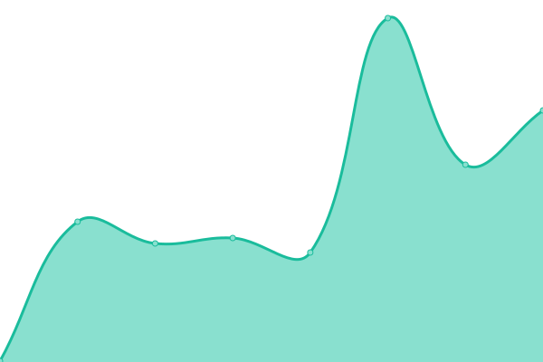

# [📈 Live Status](https://caddijp.github.io/upptime): <!--live status--> **🟩 All systems operational**

This repository contains the open-source uptime monitor and status page for [CADDi](https://caddi.tech), powered by [Upptime](https://github.com/upptime/upptime).

With [Upptime](https://upptime.js.org), you can get your own unlimited and free uptime monitor and status page, powered entirely by a GitHub repository. We use [Issues](https://github.com/caddijp/upptime/issues) as incident reports, [Actions](https://github.com/caddijp/upptime/actions) as uptime monitors, and [Pages](https://caddijp.github.io/upptime) for the status page.

<!--start: status pages-->
<!-- This summary is generated by Upptime (https://github.com/upptime/upptime) -->
<!-- Do not edit this manually, your changes will be overwritten -->
<!-- prettier-ignore -->
| URL | Status | History | Response Time | Uptime |
| --- | ------ | ------- | ------------- | ------ |
|  [caddi.jp](https://caddi.jp) | 🟩 Up | [caddi-jp.yml](https://github.com/caddijp/upptime/commits/HEAD/history/caddi-jp.yml) | 

 889ms
     
 | 

<a href="https://caddijp.github.io/upptime/history/caddi-jp">100.00%</a>
    

|  [corp.caddi.jp](https://corp.caddi.jp/) | 🟩 Up | [corp-caddi-jp.yml](https://github.com/caddijp/upptime/commits/HEAD/history/corp-caddi-jp.yml) | 

 910ms
     
 | 

<a href="https://caddijp.github.io/upptime/history/corp-caddi-jp">100.00%</a>
    

|  [caddi.tech](https://caddi.tech) | 🟩 Up | [caddi-tech.yml](https://github.com/caddijp/upptime/commits/HEAD/history/caddi-tech.yml) | 

 1027ms
     
 | 

<a href="https://caddijp.github.io/upptime/history/caddi-tech">100.00%</a>
    

|  [caddi.rs](https://caddi.rs) | 🟩 Up | [caddi-rs.yml](https://github.com/caddijp/upptime/commits/HEAD/history/caddi-rs.yml) | 

 258ms
     
 | 

<a href="https://caddijp.github.io/upptime/history/caddi-rs">100.00%</a>
    

|  [caddiinc.com](https://caddiinc.com/) | 🟩 Up | [caddiinc-com.yml](https://github.com/caddijp/upptime/commits/HEAD/history/caddiinc-com.yml) | 

 2411ms
     
 | 

<a href="https://caddijp.github.io/upptime/history/caddiinc-com">100.00%</a>
    

<!--end: status pages-->

[**Visit our status website →**](https://caddijp.github.io/upptime)

## 📄 License

- Powered by: [Upptime](https://github.com/upptime/upptime)
- Code: [MIT](./LICENSE) © [CADDi](https://caddi.tech)
- Data in the `./history` directory: [Open Database License](https://opendatacommons.org/licenses/odbl/1-0/)
